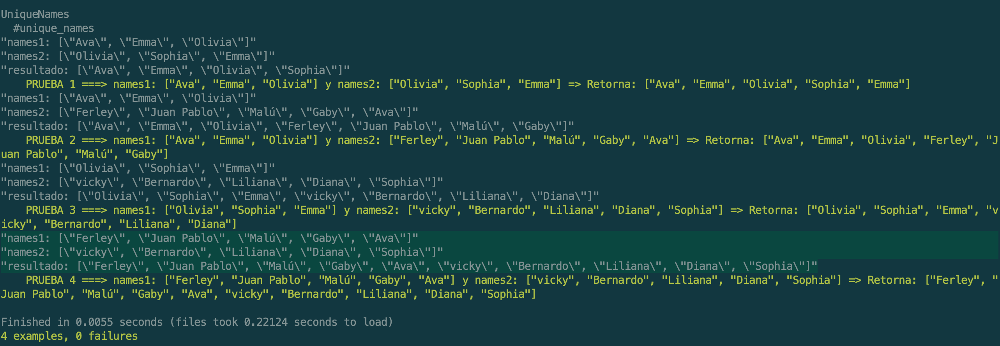
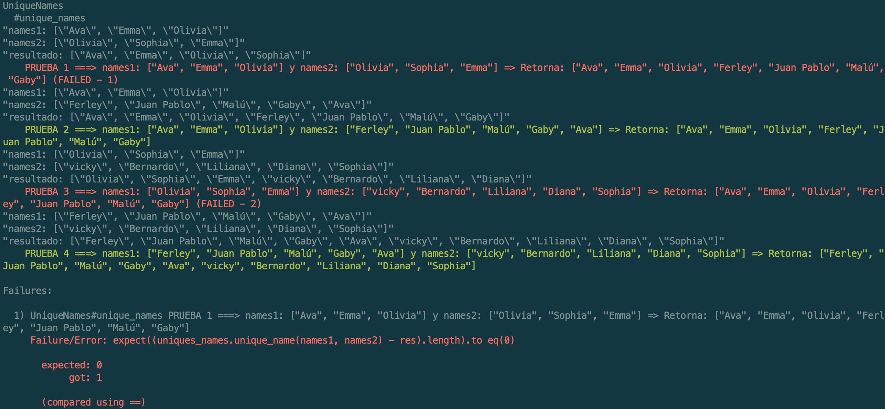

# TEST PRUEBAS UNIQUE NAMES

Repositorio con el test para método unique names que prueba de 4 formas diferentes, 4 casos de entradas.

## Procedimiento 🚀
Se deben ejecutar las siguientes intrucciones en la terminal:

```
gem install rspec
rspec --init        # En la carpeta raiz test_hoytrabajas_unique_names
```

Por último, ejecutar la siguiente instrucción:

```
rspec prueba_hoytrabajas_tdd_spec.rb --color --format doc
```

## Explicación de la prueba

Dentro del archivo de pruebas _prueba_hoytrabajas_tdd_spec.rb_ se realiza un loop basado en una matriz de vectores en el siguiente formato:

```
[
  [
    ["Ava", "Emma", "Olivia"],                    # Vector de entrada names1
    ["Olivia", "Sophia", "Emma"],                 # Vector de entrada names2
    ["Ava", "Emma", "Olivia", "Olivia", "Sophia"] # Vector de salida res
  ]
  .
  .
  .
]
```

También se importa el archivo _unique_names.rb_ donde se encuentra el _método unique_names_ que retorna el array sin duplicados e imprime en pantalla las entradas y la salida, para poderse observar en la terminal.

Con el loop, se envían las entradas con los vectores _names1_ y _names2_ combinadas 4 veces para que se realicen las 4 pruebas automáticamente y se compara con el vector _res_ correspondiente definido en la matriz. Las combinaciones de las 4 pruebas son:

```
El primer caso de prueba es el planteado en el documento PDF

names1: ["Ava", "Emma", "Olivia"]
names2: ["Olivia", "Sophia", "Emma"]
resultado: ["Ava", "Emma", "Olivia", "Sophia"]
```

```
El segundo caso de prueba es:

names1: ["Ava", "Emma", "Olivia"]
names2: ["Ferley", "Juan Pablo", "Malú", "Gaby", "Ava"]
resultado: ["Ava", "Emma", "Olivia", "Ferley", "Juan Pablo", "Malú", "Gaby"]
```

```
El tercer caso de prueba es:

names1: ["Olivia", "Sophia", "Emma"]
names2: ["vicky", "Bernardo", "Liliana", "Diana", "Sophia"]
resultado: ["Olivia", "Sophia", "Emma", "vicky", "Bernardo", "Liliana", "Diana"]
```


```
El cuarto caso de prueba es:

names1: ["Ferley", "Juan Pablo", "Malú", "Gaby", "Ava"]
names2: ["vicky", "Bernardo", "Liliana", "Diana", "Sophia"]
resultado: ["Ferley", "Juan Pablo", "Malú", "Gaby", "Ava", "vicky", "Bernardo", "Liliana", "Diana", "Sophia"]
```

Imagen de salida prueba exitosa:


Imagen de salida prueba errada:

